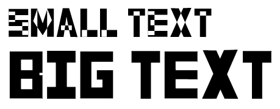

# Transparent overlaps

### Overlapping shapes with the same winding should show as filled, but once I install a font and use it in a text editor, overlapping sections are showing as transparent.

In typeface design, paths with the same winding _should_ appear filled, and two paths with opposite winding should appear transparent where they overlap. Winding is the clockwise or counterclockwise order of points in that path.

**There is a bug** where this overlap is is _not_ honored at small font sizes (typically less than 48pt), but is fine at larger font sizes.

Here is an example font with lots of overlaps present. Just to note, this is the same font, just at two different point sizes. As you can see, the small size letters show overlaps as transparent. And the large size text looks as expected.

Since this is a bug with how an Operating System displays a font file, Glyphr Studio cannot fix it.

### Simple Solution

Possibly the easiest solution is to take the `.otf` file that got exported from Glyphr Studio, and use some online file converter to convert it to an `.ttf` file. For whatever reason, once converted to TTF, these overlaps appear correctly at all sizes. 

### More involved solution

*TLDR: if overlaps are causing problems, merge shapes together to eliminate overlaps.*

This solution is more of a recommendation to change your typeface design process. There is a best practice / recommendation for creating fonts that character paths be as simplified as possible. Yes, it's easy to design a Capital Letter E as one vertical rectangle and three horizontal rectangles... but it's considered better to have this just be a single complex shape as opposed to four overlapping rectangles.

No matter if you are starting your design in Glyphr Studio, or if you are using another graphic design program like Adobe Illustrator or Inkscape, it is often times advantageous for your first past to have many stacked shapes. Whatever you feel like you need to do to get your letter form ideas turned into designs faster - step one is optimizing for speed.

At a certain point, you can call your overlapping designs mostly complete, and start step two. Duplicate your Glyphr Studio project or your graphic design save file, and do the extra work of 'flattening' or 'merging' all the shapes into as few paths as possible.

Glyphr Studio has a "Combine Shapes: Unite" command for multi-selected shapes, and a "Combine all paths: Unite" command for an entire character. Other graphic design programs also have shape combine actions - for example "Pathfinder" capabilities in Adobe Illustrator. For other graphic design programs you'll also need to "Outline Stroke", since fonts have no concept of stroke or line weight. Everything must be a closed / filled shape.

You now have a "working" design file from step one with a lot of shapes for each character, and a "flat" file from step two where everything is as simplified as it can be. This is an extra step, but when the simplified shapes are used to create a font, this overlap bug can be avoided.