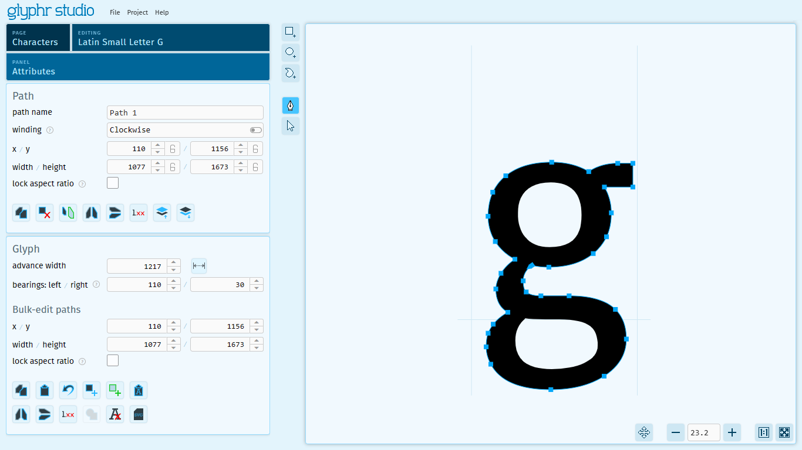

# Editing

Glyphr Studio uses a common editing experience for Characters, Components, and Ligatures,
(collectively known as 'Glyphs')
because these types of objects are all a collection of paths that form a visual
representation of a glyph.

Editor pages are split into three main areas. From left to right, the first area is
the Panels area. There is a thin area in the middle to select Tools. And finally
a large area on the right to display the edit canvas.

## Panels area

Project data is displayed two ways: the edit canvas displays a visual representation
of the data. The Panels area displays data in various lists or inputs. The Attributes
Panel, for example, displays a series of Cards that has detailed information about
whatever is currently selected. These cards have properties that you can edit, and
those changes will update on the Edit Canvas (and vise-versa, changes on the Edit Canvas
will update the detail cards). Cards also display various actions you can take on that
selected item.

Here are the main panels and their function:
- **Attributes** - Shows the detail cards for the current selection.
	- **Glyph** - if nothing is selected, the Glyph card is the only one displayed.
	- **Path** - shows information about the currently selected Path.
	- **Path Point** - shows information about the currently selected point on the path.
- **Layers** - Shows the shapes in the current item in their stack order.
- **Context characters** - Specify other characters to show around the character you are currently editing.
- **Transforms** - Select paths to have one of the available transforms applied:
  - Horizontal skew - provide either an angle or a distance to skew selected paths.
  - Offset path - provide a (positive) distance to expand selected paths, or a negative distance to shrink them.
  - Rotation - provide an angle to rotate selected paths or component instances.
- **History** - A list of actions in the Undo queue.
- **Guides** - Show, hide, and edit built in and custom guide lines.
- **Character info** - Various pieces of metadata from Unicode about the current character.
- **Quality checks** - Toggle various best practices to have them highlighted on the Edit Canvas.

## Tools

| Edit&nbsp;Tool           | Icon                                                               | Description                                                                                                                                                                                                                                           |
| ------------------------ | ------------------------------------------------------------------ | ----------------------------------------------------------------------------------------------------------------------------------------------------------------------------------------------------------------------------------------------------- |
| New&nbsp;Rectangle       |    | Draws a new rectangle path with four corner points (that don't have handles).                                                                                                                                                                         |
| New&nbsp;Oval            |              | Draws a new oval path.                                                                                                                                                                                                                                |
| New&nbsp;Path            |              | Draws a new path. Click once to add corner points. Click and drag to add a point with symmetric handles (this can be changed later). Once you're done creating a new path, you can select a different tool, or press the "Done creating path" button. |
| Add&nbsp;Path&nbsp;Point |  | Adds a path point to a path that already exists.                                                                                                                                                                                                      |
| Path&nbsp;edit           |            | This is the Pen tool, it allows you to select points, then move that point or move it's handles. The path edit tool can also directly drag path segments (not just path points) to adjust their curve.                                                |
| Resize                   |                  | This is the Arrow tool, it allows you to select a whole path, then move it or resize it.                                                                                                                                                              |
| Kern                     |                      | On the Kern page, this is the only tool, which adjusts the kern value.                                                                                                                                                                                |

For the Path Edit and Resize tools, holding down `Ctrl` will allow you to multi-select
either Paths or Path Points.

For the Add Path Point tool, holding down `Shift` will round the coordinate values of the new point to whole numbers.

Read our complete list of edit canvas functionality on the [Keyboard shortcuts](./keyboard-shortcuts.md) page.

## Edit canvas

The Edit Canvas is the visual representation of project data. Changes here will update
the Panel area details as well.

### Importing directly to the Edit Canvas
If you have an `.svg` file that represents a single Character (or Ligature or Component), you can drag and drop that file directly onto the Edit Canvas to import it. Alternatively, if you have some SVG code copied to your OS Clipboard, you can click on the Edit Canvas to give it focus, then press `Ctrl` `V` to paste, which will import that SVG code to the current item. Your Glyphr Studio clipboard has to be empty for this to work (there is a 'Clear Glyphr Studio Clipboard' command on the Glyph card).

Three things to note that will help importing SVG directly to the edit canvas:
 - It is very helpful if your SVG document is set up such that 1px = 1em. Otherwise, your imported shapes may be very large or very small compared to the font design space.
 - There is a setting "Move shapes when importing SVG file" which by default is turned off. When turned on, this will move the imported shapes to near the origin. Sometimes SVG data has unexpected overall positioning for imported shapes.
 - There is a more advanced setting called "Add default Side Bearings when importing an SVG file" which overrides the previous setting. This setting will not only move the imported shapes, but it will also add in Left and Right Side Bearings to give the imported shape an overall Advance Width.

### View controls

Along the bottom there are canvas view controls, from left to right they are:
| View&nbsp;Tool | Icon | Description |
| --- | --- | --- |
| Pan |  | Move the view left / right / up / down. You can also toggle Pan by holding down `Space bar` or `Middle mouse wheel`. |
| Zoom |  | There are Zoom Out `-`, Zoom readout %, and Zoom In `+` controls grouped together. The `-` and `+` buttons adjust the zoom %. |
| Zoom&nbsp;1:1 |  | The Zoom 1:1 button sets the zoom level such that 1 pixel on your screen is equal to 1 Em unit from your project. |
| Zoom&nbsp;to&nbsp;fit |  | This will auto-fit the current glyph to however big your window is currently. |
| Live&nbsp;Preview |  | Pop out a second screen for a live preview of your font. |

You can also use the keyboard shortcut `Ctrl` `Space` to toggle the Distraction Free Preview. This is an overlay that just shows the current glyph (or context characters) against a white background, hiding all the UI, grid, and guide lines to be able to focus on the shapes alone.