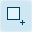

# Editing

Glyphr Studio uses a common editing experience for Characters, Components, and Ligatures,
(collectively known as 'Glyphs')
because these types of objects are all a collection of paths that form a visual
representation of a glyph.

Editor pages are split into three main areas. From left to right, the first area is
the Panels area. There is a thin area in the middle to select Tools. And finally
a large area on the right to display the edit canvas.

## Panels area

Project data is displayed two ways: the edit canvas displays a visual representation
of the data. The Panels area displays data in various lists or inputs. The Attributes
Panel, for example, displays a series of Cards that has detailed information about
whatever is currently selected. These cards have properties that you can edit, and
those changes will update on the Edit Canvas (and vise-versa, changes on the Edit Canvas
will update the detail cards). Cards also display various actions you can take on that
selected item.

### Detail cards

The main detail cards are:

- **Glyph** - if nothing is selected, the Glyph card is the only one displayed.
- **Path** - shows information about the currently selected Path.
- **Path Point** - shows information about the currently selected point on the path.

## Tools

| Edit&nbsp;Tool           | Icon                                                               | Description                                                                                                                                                                                                                                           |
| ------------------------ | ------------------------------------------------------------------ | ----------------------------------------------------------------------------------------------------------------------------------------------------------------------------------------------------------------------------------------------------- |
| New&nbsp;Rectangle       |    | Draws a new rectangle path with four corner points (that don't have handles).                                                                                                                                                                         |
| New&nbsp;Oval            |              | Draws a new oval path.                                                                                                                                                                                                                                |
| New&nbsp;Path            |              | Draws a new path. Click once to add corner points. Click and drag to add a point with symmetric handles (this can be changed later). Once you're done creating a new path, you can select a different tool, or press the "Done creating path" button. |
| Add&nbsp;Path&nbsp;Point |  | Adds a path point to a path that already exists.                                                                                                                                                                                                      |
| Path&nbsp;edit           |            | This is the Pen tool, it allows you to select points, then move that point or move it's handles.                                                                                                                                                      |
| Resize                   |                  | This is the Arrow tool, it allows you to select a whole path, then move it or resize it.                                                                                                                                                              |
| Kern                     |                      | On the Kern page, this is the only tool, which adjusts the kern value.                                                                                                                                                                                |

For the Path Edit and Resize tools, holding down `Ctrl` will allow you to multi-select
either Paths or Path Points.

For the Add Path Point tool, holding down `Shift` will round the coordinate values of the new point to whole numbers.

## Edit canvas

The Edit Canvas is the visual representation of project data. Changes here will update
the Panel area details as well.

Along the bottom there are canvas view controls, from left to right they are:
| View&nbsp;Tool | Icon | Description |
| --- | --- | --- |
| Pan |  | Move the view left / right / up / down. You can also toggle Pan by holding down `Space bar` or `Middle mouse wheel`. |
| Zoom |  | There are Zoom Out `-`, Zoom readout %, and Zoom In `+` controls grouped together. The `-` and `+` buttons adjust the zoom %. |
| Zoom&nbsp;1:1 |  | The Zoom 1:1 button sets the zoom level such that 1 pixel on your screen is equal to 1 Em unit from your project. |
| Zoom&nbsp;to&nbsp;fit |  | This will auto-fit the current glyph to however big your window is currently. |
| Live&nbsp;Preview |  | Pop out a second screen for a live preview of your font. |
