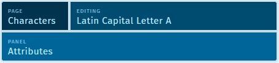
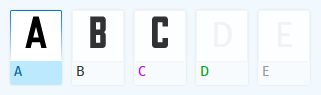

# Navigation

In the upper left of the app, the primary navigation is for each "Page". Each page in Glyphr Studio serves a different function. Details can be found in the Pages section in these help docs.

The primary nav menu is in dark blue:

When expanded, shows all the pages:

## Editor pages

The Characters, Components, and Ligatures pages are pages that include editing controls. They also have additional navigation options in the upper left. The Page navigation is reduced in size, and an additional Glyph Chooser and Panel Chooser is shown.

### Glyph Chooser

The Glyph Chooser is labeled "Editing" and shows the name of the glyph that is currently being worked on. Selecting this will launch a large Glyph Chooser flyout where you can select any character in your project.

#### Glyph tiles and their states

Glyph tiles (Used for Characters, Ligatures, and Components) have a couple of different color variations, which display information about that item's edit state. You can also hover over a glyph tile to see this information in a tool-tip.

The different edit states are (from left to right):

 - **Blue**: is the currently selected item.
 - **Black**: is a regular item (that was previously created and saved).
 - **Purple**: is an item that unsaved edits (recently edited).
 - **Green**: is an 'empty' item. This item was created, but no edits were made to it. There is an option in Settings > App that toggles whether or not these items are exported to fonts.
 - **Gray**: For characters, these are characters in the current Character Range that have not been created yet.

### Panel Chooser

There are many different panels that support the editing experience. These may be different depending on if you are editing a Glyph, a Component, or a Ligature.

Mainly, these panels are:

- **Attributes** - Show detailed information and inputs about the currently selected Glyph, Path or Component Instance, and Path Point.
- **Layers** - Shows a list of all the paths and component instances in the current glyph.
- **Context characters** - Show other characters inline with the one you are currently editing.
- **History** - Shows a visual representation of the undo history for this project.
- **Guides** - Options for showing or hiding various guides on the edit canvas.
