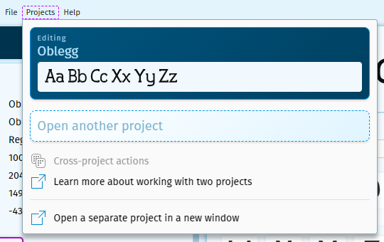
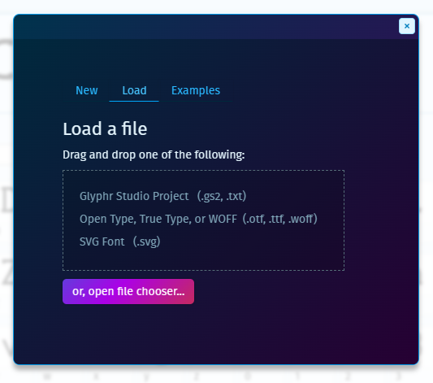
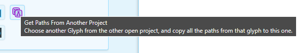
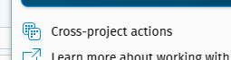
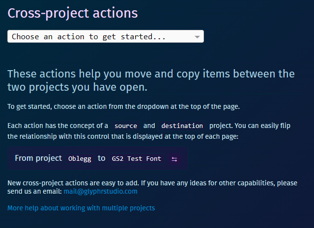

# Working with multiple projects

Glyphr Studio is able to open and switch between 2 projects within the app. This
allows for cross-project actions.

## Getting started

The first step, after opening a single project, is to go to the `Projects` menu
and select "Open another project"

This will launch a screen very similar to the initial Open Projects page, except in
a dialog box.

You can create a new project, or load another existing project (including drag-and-dropping a
file onto the dialog box).

## What's possible with two projects

The first benefit to working with two projects is being able to copy shapes from an item in another project into the current project. In the Glyph attribute card, you can select the "Get Paths From Another Project" action. This will launch a glyph chooser dialog that displays items from the other project. Once you select an item, it's shapes will be copied from the other project into the current one.

The other main benefit of having two open projects is that it unlocks Cross-project Actions. From the `Projects` menu, selecting Cross-project actions:

Will launch a new page:

An important concept to understand is that these actions have a "source" project and "destination" project. Which project is which can be easily flipped with the `⮀` button.

Generally, you can select items from the source project, and they get transferred (somehow) to the destination. The details about what happens, along with what options are available, are outlined below.

## Main use cases & what isn't possible

By far the most requested feature in Glyphr Studio v1 was on the topic of
merging fonts, or moving a few characters from one font to another. Cross-project
actions aim to meet these scenarios - and even extends the idea to Kern Groups and
project settings.

Component instances / component roots are the big thing that is not possible when merging two projects. In order to safely move glyphs, each one has their component instance links 'resolved' before the move. So, the destination glyph will look the same as the source glyph, but, importantly, the component instances will all be converted to regular stand-alone paths.

Moving characters or ligatures while maintaining all their current component links would be an incredibly complex action, and is not currently possible.

## Details for each cross-project action

&nbsp;

### Copy character or ligature shapes

<Badge type="tip">This is a copy action, so nothing will be deleted from the destination project.</Badge>

This action will take a copy of each path (or paths from a resolved component link) from the source project and insert them into the same character in the destination project.

Glyph-level data will not be copied over (with the exception of the Advance Width option below), this action only deals with path-level objects.

If the character or ligature object does not exist in the destination project, a default one will be created.

> Options:
>
> - Scale copied items, if the source and destination Em sizes do not match.
> - Update the destination item's Advance Width to maintain right-side bearing.
> - Reverse copied shapes' windings.

&nbsp;

### Overwrite characters or ligatures

<Badge type="warning">This is an overwrite action, so items in the destination project will be deleted and replaced.</Badge>

This action will take the selected characters or ligatures from the source project, and add them to the destination project. If a character or ligature already exists in the destination project, it will be overwritten.

If the character or ligature object does not exist in the destination project, a default one will be created.

This action deals with glyph-level objects, so all associated metadata for the glyph object will be overwritten in the destination project.

> Options:
>
> - Scale copied items, if the source and destination Em sizes do not match.
> - Reverse copied shapes' windings.

&nbsp;

### Add component roots

<Badge type="tip">This is an add action, so new items will be created in the destination project.</Badge>

This action will duplicate the selected components from the source project and add them to the destination project, ensuring they have unique IDs.

Copy and overwrite actions are available for Characters and Ligatures, but not
for Components. This action is the only way to move Components from one
project to another.

> Options:
>
> - Scale copied items, if the source and destination Em sizes do not match.
> - Reverse copied shapes' windings.

&nbsp;

### Add kern groups

<Badge type="tip">This is an add action, so new items will be created in the destination project.</Badge>

This action will duplicate the selected kern groups from the source project, and add them to the destination as new kern groups. If the destination project already has an identical kern group, then the value will **not** be copied over.

> Options:
>
> - Scale copied items, if the source and destination Em sizes do not match.

&nbsp;

### Overwrite settings

<Badge type="warning">This is an overwrite action, so items in the destination project will be deleted and replaced.</Badge>

This action will take the values from the selected settings in the source project, and overwrite the same setting's value in the destination project.

## Something missing?

Cross-project actions are relatively easy to add. If you have a scenario that is not met by one of the actions above, please let us know your idea and there is a good chance we can add it in future versions.

mail@glyphrstudio.com
