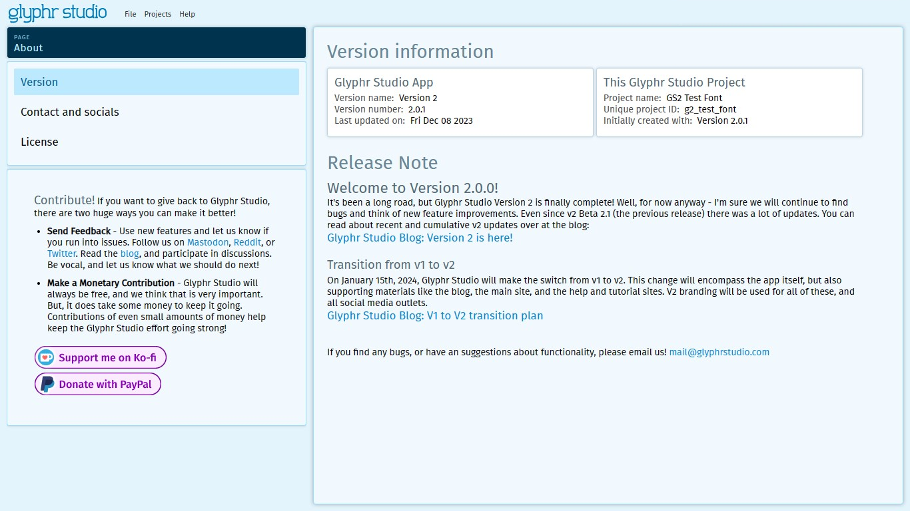

# About

The About page gives you lots of information about Glyphr Studio, and the project you currently have open.

## Version

This will give you two pieces of information. The first is the granular version number for the Glyphr Studio App that you are using. The second is project information about the project you currently have open.

## Contact and socials

A nice table laying out all the various ways to interact with Glyphr Studio and it's community.

## License

This section displays license information about the Glyphr Studio App, and also the external JavaScript libraries that Glyphr Studio leverages to make the App functional.

## Contribute

There are two main ways you can help out the Glyphr Studio effort: Give us feedback, and consider making a monetary contribution. Links to how to do this can be found in the left panel of the About page.
