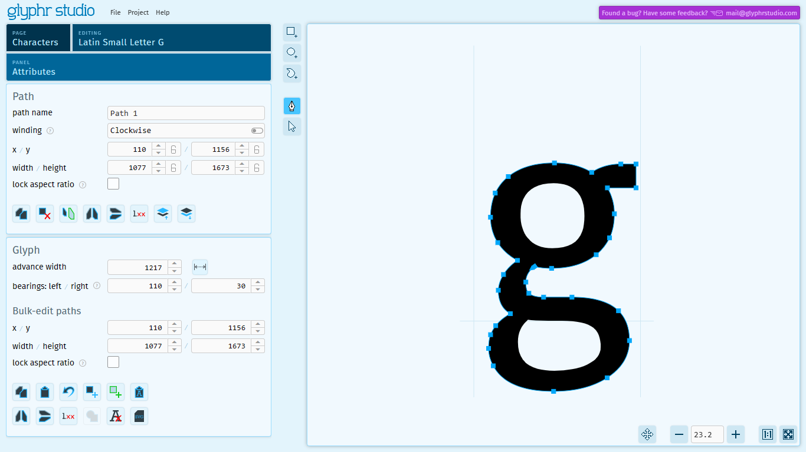

# Characters

The Characters page is the main area where you edit paths that make up characters in your font.

Characters are a type of `Glyph` object that represent regular letters in your font.

### Characters, glyphs, letters, code points... what's the difference?

At a high level, these words kinda mean the same thing. But once we get down into the details of creating a font, there are subtle differences that may matter:

- A **glyph** is one or more visual shapes that represent a character, or some letter-like thing that has stand-alone meaning.
- A **character** is the concept of a letter in an alphabet, which can be visually represented in many different ways.
- **Code point** is a word that Unicode uses to uniquely identify characters, and it's also how Glyphr Studio identifies characters in a project.

A good way to think about _visual representation_ of a character vs. _the concept of_ a character is this: if you have a text editor, you can type characters and words, and those characters and words have meaning. You can also change the font that those characters and words are displayed as. Fonts make characters look different, but their meaning does not change. In Unicode, for example, `Latin Capital Letter A` is identified as code point `U+41` or `0x41`. The Unicode code point does not care how each font draws that letter. But giving it a unique ID allows that specific character to be displayed no matter what glyph from a font you use.

In Glyphr Studio, we actually use the word `Glyph` to refer to characters, ligatures, and components.

### Unicode

Unicode is the system that fonts use to identify `Glyph` objects as a specific character. Unicode defines 'code points' which is basically just a unique ID number, and a name for that particular character. Unicode code points can be just a regular (decimal) number, but most often they are represented by a hexadecimal number with a `U+` prefix.

Unicode is broken down into 'planes' - and the first one is called the Basic Multilingual Plane. These are characters `U+0000` through `U+FFFF`. Since we're dealing with hexadecimal numbers, each digit can be one of `0123456789ABCDEF` for a total of 65,536 Unicode code points in the BMP. Not every Unicode code point has a character associated with it (some are left intentionally blank) but still, there are a huge amount of characters available. In Glyphr Studio, you can enable any range of characters you want (the default is the 'Basic Latin' character range).

If you are curious about exploring Unicode, you can check out Glyphr Studio's sister project: [https://unicode.ninja](https://unicode.ninja) - this is a tool where you can browse through all the character ranges in the BMP, get details on any individual character, or search for characters by name.
