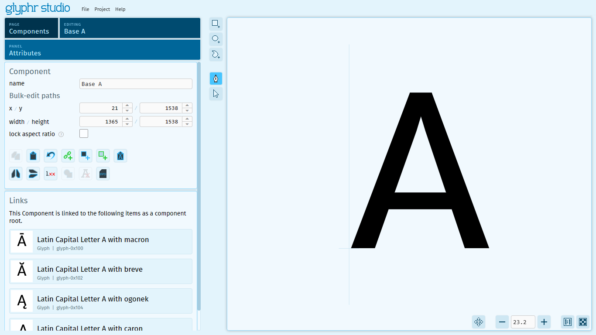

# Components

Components are a Glyphr Studio feature that lets you re-use a collection of paths across many different glyphs. The root is called a 'Component' and these are added by reference to other glyphs, where they are called 'Component Instances'. Updating the root component will also update all component instances.

Diacritic glyphs (glyphs with accents) are just one example of where having a shared component root can be used across many individual characters.

There are way more details about Component Roots and Component Instances over at the [Data types / Components](../data-types/components) article.

