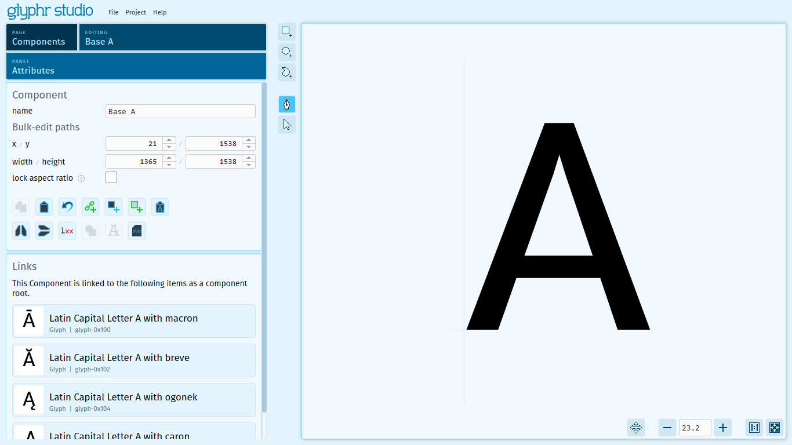

# Components

Components are a Glyphr Studio feature that lets you re-use a collection of paths across many different glyphs. The root is called a 'Component' and these are added by reference to other glyphs, where they are called 'Component Instances'. Updating the root component will also update all component instances.

Components are a type of `Glyph` that is not directly associated with a character or letter in your font. Components lets you define and re-use a collection of paths across many different glyphs. The root is called a 'Component' and these are added by reference to other glyphs, where they are called 'Component Instances'. Updating the root component will also update all component instances.

Diacritic glyphs (glyphs with accents) are just one example of where having a shared component root can be used across many individual characters.

Glyphr Studio Components (the roots) are not exported to fonts - they are a concept that is only in place to help design a font. All Component Instances will be exported to your font, along with regular Paths. Depending on your export settings and target format, Component Instances are exported either as TrueType composite glyphs (referencing the component's outlines) or as standard flattened font outlines - see [Exporting fonts with components](#exporting-fonts-with-components) below.

## Component Roots and Component Instances

The link between roots and instances is shown on both glyphs, making it easy to navigate back and forth.

Any Glyph object (Character, Ligature, or Component) can be used as a component root. When you are on the edit page for a glyph that is being used as a root component, a card with a list of links will be shown in the panel area. Clicking on one of these links will navigate you to the other glyph that is using the root as a Component Instance.

Component Instances are shown along-side Paths - in both the Layers panel, and as a Component Instance card that is similar to the Path card in the Attributes panel. There will also be a link when a Component Instance is selected that will navigate you back to the Root Component glyph.

In the Layers Panel as well as on the Edit Canvas, regular paths have a 🟦Blue accent color. Component Instances have a 🟩Green accent color.

## Component Instance transforms

Many times, you'll only need to use the Component Instance with no changes with regards to it's Component Root. But, you may have to move, resize, or otherwise adjust a Component Instance to make it work in the destination glyph.

Component Instances _do not_ have size or position attributes. Everything is in relation to it's Root Component. Component Instances only have x and y offsets, changes in width and height, and other transform information. This way, when the Root Component is edited, a Component Instance inherits all the changes, and then applies any additional transforms as needed.

### Available transforms

| Transform&nbsp;name                    | Description                                                                                                                                                                                                                                                                                            |
| -------------------------------------- | ------------------------------------------------------------------------------------------------------------------------------------------------------------------------------------------------------------------------------------------------------------------------------------------------------ |
| **Δ&nbsp;x** and **Δ&nbsp;y**          | The difference in x or y position, as compared to the Root Component.                                                                                                                                                                                                                                  |
| **Δ&nbsp;width** and **Δ&nbsp;height** | The difference in width or height, as compared to the Root Component.                                                                                                                                                                                                                                  |
| **flip vertical**                      | Flip top to bottom, as compared to the Root Component.                                                                                                                                                                                                                                                 |
| **flip horizontal**                    | Flip left to right, as compared to the Root Component.                                                                                                                                                                                                                                                 |
| **reverse winding**                    | Reverse all the windings, as compared to the paths in the Root Component.                                                                                                                                                                                                                              |
| **rotation**                           | Number of degrees of rotation\* as compared to the Root Component.                                                                                                                                                                                                                                     |
| **rotate first**                       | When applying both rotation and size changes to a shape, the order of rotate/resize or resize/rotate will end up with two different results. Glyphr Studio tries to be smart about which to do first, but selecting this option will force the rotate transform to happen before the resize transform. |

**\*Rotation Note** Glyph Studio uses an angle system of Degrees - 360° total, with the top being 0°, moving clockwise for positive values and counter-clockwise for negative values. The bottom of the circle (6 o'clock or 180°) the values switch between positive and negative. So, rotating a shape counter-clockwise will use angle values -1° through -179°, and rotating a shape clockwise will use angle values 0° through 180°.

## Exporting fonts with components

Glyphr Studio Components (the roots) are never exported - they are a design-time concept. Component Instances, however, _are_ exported. By default Glyphr Studio exports them as TrueType _composite glyphs_, which reference the component's outlines and store only an offset, rather than flattening each instance into its own outlines. This is controlled by the **Export components as composite glyphs** setting on the [Project settings](./settings#project) page (on by default).

A few rules determine whether a given Component Instance is actually exported as a composite reference or flattened to outlines:

- **TrueType only.** Composite glyphs only exist in TrueType-flavored fonts (`.ttf`, `.woff`, `.woff2`). Exporting to OTF/CFF (`.otf`) always flattens components to outlines, because the CFF format cannot store composites.
- **Pure-position components only.** A Component Instance is kept as a composite reference only when it is a plain translation (an x/y offset). If it has any resize (Δ width / Δ height), rotation, horizontal/vertical flip, or reversed winding, that instance is flattened to outlines. A single glyph can be partially composite and partially flattened, on a per-component basis.
- **Round-trip fidelity.** Same-format round-trips (TTF → Glyphr Studio → TTF) preserve component structure with high fidelity. When the format changes (for example TTF → OTF), only the conceptual/visual result is preserved, not the composite structure.
- **Turning it off.** Unchecking the setting produces fully flattened outlines for every glyph - the previous/legacy export behavior - which can be useful for maximum compatibility with tools that don't handle composite glyphs well.
