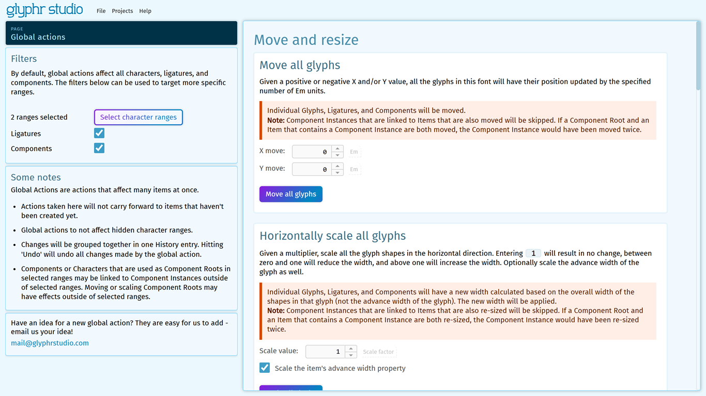

# Global Actions

Sometimes you want to make a similar change to every item in your font. These types of bulk changes are possible through the Global Actions page.

Descriptions and more details can be found on the page. The section highlighted in orange gives you a technically complete description of what exact changes will be made.

### Filters

By default, Global Actions will be enabled on all Characters, Ligatures, and Components. Some Global Actions will only have an effect on one type of item just based on the action (for example, "Side Bearings" action won't do anything to Components, because Components don't have any Side Bearings).

In the sidebar, there is a Filters card where you can include or exclude Character Ranges (via a dialog), Ligatures, and/or Components.

If there is a specific set of Characters that is not currently described by a Character Range, you'll have to go to the Setting > Project page, and create a range using the "Add a custom character range" dialog. Character Ranges can overlap if you need them to.

### Some things to keep in mind

- Actions taken here will not carry forward to items that haven't been created yet.
- Global actions to not affect hidden character ranges.
- Changes will be grouped together in one History entry. Hitting 'Undo' will undo all changes made by the global action.
- Components or Characters that are used as Component Roots in selected ranges may be linked to Component Instances outside of selected ranges. Moving or scaling Component Roots may have effects outside of selected ranges.

### Actions

Here is an overview of the types of actions you can take:

**Move and resize**

- Move all glyphs
- Horizontally scale all glyphs
- Vertically scale all glyphs
- Re-size all glyphs
- Skew all glyphs
- Side bearings

**Project cleanup**

- Convert all Component Instances into Paths
- Round all point values
- Remove items from your project (Characters, Ligatures, Components)

**Font types**

- Monospace font
- All-caps font

**Diacritics**

- Diacritical glyph generator (basic)
- Diacritical glyph generator (advanced)

### Other ideas for global actions?

These are relatively easy to add, so if you have an idea for a new global action, please send us an email! [mail@glyphrstudio.com](mailto:mail@glyphrstudio.com)
