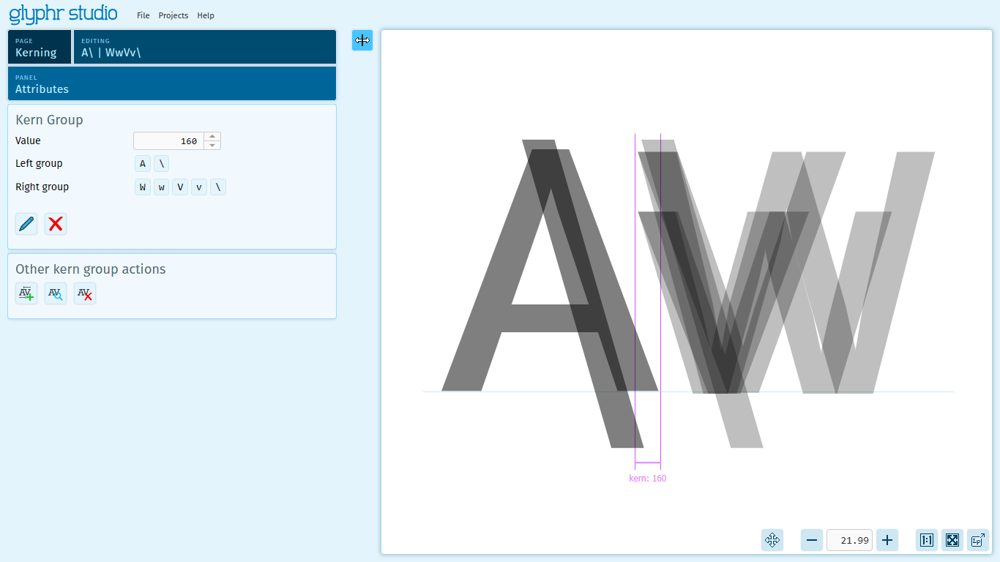

# Kerning

Kerning is an advanced feature of fonts that recognizes a pair of characters, then adjusts the spacing between them to some custom value. The default spacing between characters is zero - which is to say, the white space (side bearings) within each character are the only space shown.

Some letter combinations, like `VA` as an example, if the default side bearing spacing is used, the letters visually look very far apart. Kerning can help the visual flow of character pairs look more well considered. Many character pairs may need either negative or positive kern values to make them "look right".

## Class-based kerning

Font files encode kerning values as three pieces of information: a left character, a right character, and a horizontal adjustment value. Fonts with many characters can end up having a huge amount of kern pairs. Glyphr Studio uses a system called Class-based Kerning, where groups of characters with similar edges (like `VvWw`) can be treated as a single left-hand group, and a group of right-hand characters (for example,`A/`) can be treated as single group - which can be given a single value. When a font is exported, the permutations are saved as individual kern pairs. But, while editing, grouping common characters often simplifies the overall kerning process.

## Please note

 - It is not possible to kern Ligature characters in Glyphr Studio. If you need this functionality, please use another font editor, like Fontforge.