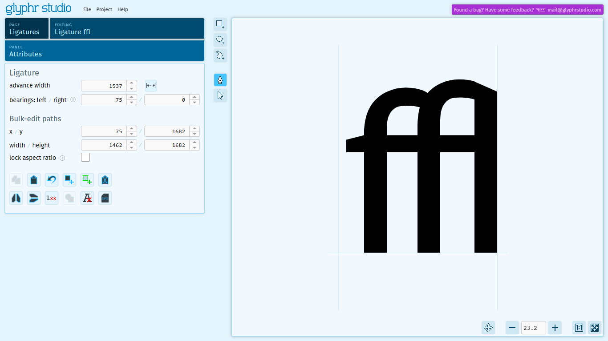

# Ligatures

Ligatures are a feature of fonts where a specified sequence of characters is recognized and replaced with a single new character that you design. _Ligatures can have any sequence of two or more characters_. In a text editing program that has ligatures enabled, this sequence of characters is recognized, then replaced with the custom ligature character that you design.

Ligatures are a `Glyph` data type - they are a feature of fonts where a specified sequence of characters is recognized and replaced with a single new character that you design.

Some common Latin ligatures have an assigned Unicode code point (so, some Ligatures are Unicode Characters). But, _Ligatures can be defined by any sequence of two or more characters_. In a text editing program that has ligatures enabled, this sequence of characters is recognized, then replaced with the custom ligature character that you design. These custom Ligature characters are part of a font file, but they do not have an associated Unicode code point (some Ligatures are not Unicode Characters).

### Note about ligature characters and their source characters
**Source characters must be below `U+FFFF`**

Unicode characters above the Basic Multilingual Plane (above `U+FFFF`) are sometimes interpreted as a sequence of two characters, even though they have a single code point. In Glyphr Studio, this confuses how we define a Ligature. Specifying characters above `U+FFFF` is not allowed, as it causes unexpected behavior.

**Source characters must exist in the project**

Within the font file, Ligature characters are saved as a type of character that references two or more other characters in the font. Taking `ffi` as an example - usually you would design the `f` character and the `i` character, as well as create a Ligature for `ffi`, defined as `f` `f` `i`. In this case, the font has entries for all the 'source' characters in the ligature.

You could, though, create a ligature for `ffi` without designing the individual `f` character. But, the missing `f` character would cause an error in the resulting font, because the ligature has nothing to reference. In this case, Glyphr Studio will create the `f` character for you to avoid this error. On export, for all of these 'missing source characters', a new character will be added to your project. This added character won't have any shapes or advance width, but it will be exported to your font file.

## Common use cases

### Traditional Latin

In Latin, there are some common ligatures that have been around for hundreds of years. These common ligatures are included in Unicode and have their own code point:

`ae` -> `æ`,&emsp; `AE` -> `Æ`,&emsp; `ff` -> `ff`,&emsp; `fi` -> `fi`,&emsp; `fl` -> `fl`,&emsp; `oe` -> `œ`,&emsp; `OE` -> `Œ`,&emsp; `st` -> `st`,&emsp; `ffi` -> `ffi`,&emsp; `ffl` -> `ffl`

### Cursive

If you are creating a font that has a cursive or handwritten feel to it, Ligatures may be able to help you customize how two specific letters are attached. As a warning, permutations can add up quickly: if you made a Ligature character for every lowercase letter pair, that's 676 Ligatures you have to design. It would probably be good to use a strategy where many of the characters connect at a common point (maybe around the baseline) and just use ligatures for edge cases. For example, lowercase `o` in cursive connects to the next letter somewhere between the baseline and the x height.

### Abugidas

An [abugida](https://en.wikipedia.org/wiki/Abugida) is a writing system where consonants and vowels are written as a single letter. If you are developing your own Constructed Language (conlang) and want to have a font to use for you abugida-based writing system, then Ligatures are probably right for you.

Using Latin as an example, it would be like being able to type `n` and `~` together, then have them automatically form a `ñ`.

In this system you would need (number of consonants) x (number of vowels) amount of Ligature characters... again, this could result in a very large set of Ligatures you need to design. This could be lessened if the base consonants were designed as stand-alone characters first, they could easily be added to many other Ligatures as [Components](./components.md).

Another strategy for creating an Abugida font may not leverage Ligatures. If your vowels have the same position no matter what it's base consonant looks like, then you could choose either all your vowels or all your consonants to have zero advance width. This means whatever character is typed next would be placed "over" the first character. The advantage of this system would be having to avoid having to create ligature characters for every single permutation, at the cost of not being able to place glyph elements in custom locations.
