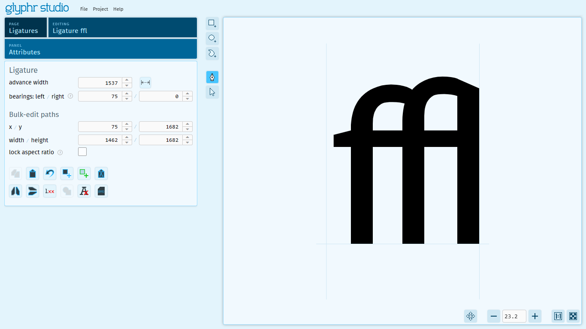

# Ligatures

Ligatures are a feature of fonts where a specified sequence of characters is recognized and replaced with a single new character that you design. In Latin, there are some common ligatures: 

`ae` -> `æ`,&emsp;  `AE` -> `Æ`,&emsp;  `ff` -> `ff`,&emsp;  `fi` -> `fi`,&emsp;  `fl` -> `fl`,&emsp;  `oe` -> `œ`,&emsp;  `OE` -> `Œ`,&emsp;  `st` -> `st`,&emsp;  `ffi` -> `ffi`,&emsp;  `ffl` -> `ffl`

These are just some examples. *Ligatures can have any sequence of two or more characters*. In a text editing program that has ligatures enabled, this sequence of characters is recognized, then replaced with the custom ligature character that you design.

