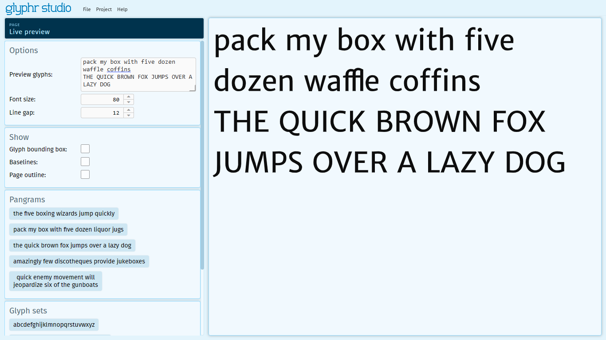

# Live preview

The Live preview page is a place where you can preview your font in use. 
All applications that use fonts can interpret that font data differently. 
Glyphr Studio uses a custom preview technology - other applications or programs 
may have different settings or layout logic that results in blocks of text looking 
different than what you may see on the Live Preview page.

But, overall, this is a great place to check in to see how strings of text 
or large blocks of text look as you are designing your font.

