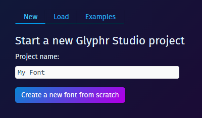

# Open project

This is the first landing page of the app. You'll have three choices to get going:
 - Start a new Glyphr Studio project
 - Load an existing project, or import an existing font
 - Load an example project

You can also drag and drop one of the following files anywhere on the Open Project screen (no need to be on the 'Load' tab):

 - Glyphr Studio Project file `.gs2` (version 2 format)
 - Glyphr Studio Project file `.txt` (this is the v1 format, must be at least version 1.13.2)
 - OpenType font file `.otf`
 - TrueType font file `.ttf`
 - Web Open Font Format `.woff`
 - SVG Font `.svg` (note, this needs to be a "SVG Font" file, not just any SVG file.)