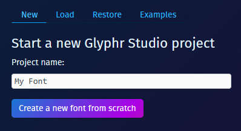

# Open project

This is the first landing page of the app. You'll have four choices to get going:
 - Start a new Glyphr Studio project
 - Load an existing project, or import an existing font
 - Restore a previously auto-saved project
 - Load an example project

## New
Just provide a project name and a default project will be created. To start with, the Project Name will also be used as the Font Name, but you can change these to be different on the Settings > Project page or the Settings > Font page.

## Load
You can use your OS File Chooser to select a file, or drag and drop one of the following files anywhere on the Open Project screen (no need to be on the 'Load' tab):

 - Glyphr Studio Project file `.gs2` (version 2 format)
 - Glyphr Studio Project file `.txt` (this is the v1 format, must be at least version 1.13.2)
 - OpenType font file `.otf`
 - TrueType font file `.ttf`
 - Web Open Font Format `.woff`
 - SVG Font `.svg` (note, this needs to be a "SVG Font" file, not just any SVG file.)

## Restore
Auto-save is enabled by default, and the most recent change for each project is saved to your browser's local storage. The Restore tab shows a list of these auto-saved projects that you can restore.

You can disable auto-saving for this project on the Settings > App page. You can also clear all auto-saved backups for all projects on this page.

## Examples
Two example projects are included if you just want to explore features and the overall experience. 'Oblegg' is actually the font that we use to create the Glyphr Studio logo and other brand stuff. The 'Simple v2 Project' just has a few characters and other things... it is a very basic project. Having two example projects lets you test out the Cross-project Actions functionality without creating anything.