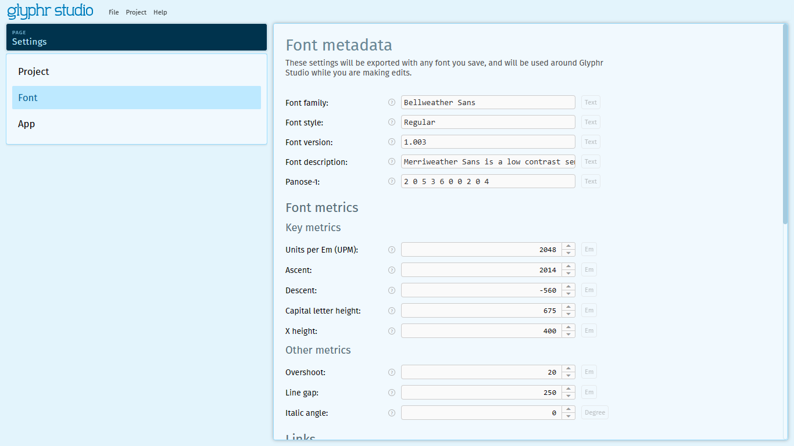

# Settings

The Settings page is where you can adjust different behaviors or data for your Project, the App, or your Font.

## Project

#### _Project name_ <badge type="info">Text</badge>

Name for this project. Can be different than the Font or Font Family name. Also, this will be used as the name of the saved Glyphr Studio Project (.gs2) file.

#### _Version_ <badge type="info">Read only</badge>

The latest app version that edited this project file.

#### _Initial version_ <badge type="info">Read only</badge>

The app version this project file was first created with.

#### _Project ID_ <badge type="info">Read only</badge>

A unique ID used to identify this project.

## Font

#### _Font family_ <badge type="info">Text</badge>

Base font family name, that will be shared across font styles. This will also be used as the base name for exported font files.

#### _Font style_ <badge type="info">Text</badge>

Describes this font within the overall font family. Usually a combination of how bold this font is and if it is italic.

example:

`Thin`, `ExtraLight`, `Light`, <strong>`Regular`</strong>, `Medium`, `SemiBold`, <strong>`Bold`</strong>, `ExtraBold`, `Black`,

`Thin Italic`, `ExtraLight Italic`, `Light Italic`, <strong>`Italic`</strong>, `Medium Italic`, `SemiBold Italic`, `Bold Italic`, `ExtraBold Italic`, `Black Italic`

#### _Font version_ <badge type="info">Text</badge>

If this font gets updates regularly, keep track of what version this iteration is. This is recommended to be in Semantic Versioning format, you can learn more at <a href="https://semver.org/" target="_blank">semver.org</a>.

example: `Version 1.0`

#### _Font description_ <badge type="info">Text</badge>

Open-ended text to describe your font.

#### _Panose-1_ <badge type="info">Text</badge>

Uses ten digits to describe the font's visual style. A good overview can be found on Monotype's GitHub page: <a href="https://monotype.github.io/panose/pan2.htm" target="_blank">monotype.github.io/panose/pan2.htm</a> Each digit of the ten digits is separated by a space, and has a special meaning based on its position.

example:

<strong>`0 0 0 0 0 0 0 0 0 0`</strong>

All zeros describe this font as 'any', which basically leaves it undefined.

<strong>`2 0 0 0 0 0 0 0 0 0`</strong>

The first digit is the major designator, where digit 2 represents Latin typefaces.

### Font metrics - Key metrics

 

#### _Units per Em (UPM)_ <badge type="info">Em</badge>

UPM is the measure of the overall design space for a character in this fontThink of UPM like how many pixels of height you have to work with for each character. UPM can be any number, but traditionally it is either 1000 or 2048.

example: `1000`, `2048`

#### _Ascent_ <badge type="info">Em</badge>

Distance from the baseline to the top of square and tall lowercase letter(Like: b d h k l).

#### _Descent_ <badge type="info">Em</badge>

Distance from the baseline to the bottom of letters that have square descenders (Like: p q y depending on style). This is expressed as a negative number.

#### _Capital letter height_ <badge type="info">Em</badge>

Distance from the baseline to the top of square capital letters (Like: A B E F H I K L M N P R T U V W X Y Z). Usually this is slightly smaller than the ascent.

#### _X height_ <badge type="info">Em</badge>

Distance from the baseline to the top of square lowercase letters (Like: v x z).

### Font metrics - Other metrics

 

#### _Overshoot_ <badge type="info">Em</badge>

Rounded characters are usually slightly larger than square characters to compensate for visual weight. For example, a lowercase 'o' will extend slightly above and below a lowercase 'x'. Overshoot is the measure of this distance.

#### _Font weight_ <badge type="info">Text</badge>

How bold this font is. Can be 'normal', 'bold', or a number between 100 and 900:

How bold this font is - a number between 100 and 900.

Examples:

Thin = `100` ,
Extra-Light = `200` ,
Light = `300` ,
Regular = `400` ,
Medium = `500` ,
Semi-Bold = `600` ,
Bold = `700` ,
Extra-Bold = `800` ,
Black = `900` ,

#### _Italic angle_ <badge type="info">Degree</badge>

Most common degree of slant for glyphs in an italic font. Should be negative if leaning to the right.

### Links

 

#### _Designer_ <badge type="info">Text</badge>

Person or team who created this font.

#### _Designer's URL_ <badge type="info">Text</badge>

URL for the designer.

#### _Manufacturer_ <badge type="info">Text</badge>

Company who created this font.

#### _Manufacturer's URL_ <badge type="info">Text</badge>

URL for the manufacturer.

#### _License_ <badge type="info">Text</badge>

License under which this font is release

#### _License URL_ <badge type="info">Text</badge>

URL for the license.

#### _Copyright_ <badge type="info">Text</badge>

Copyright string

#### _Trademark_ <badge type="info">Text</badge>

Trademark string

### Properties for SVG Fonts

_These properties only get exported with SVG Fonts, not OTF fonts_

#### _Font variant_ <badge type="info">Text</badge>

Either 'normal' or 'small-caps'.

#### _Font stretch_ <badge type="info">Text</badge>

How condensed or expanded this font is.

example:

`normal`, `ultra-condensed`, `extra-condensed`, `condensed`, `semi-condensed`, `semi-expanded`, `expanded`, `extra-expanded`, `ultra-expanded`

#### _Vertical stem_ <badge type="info">Em</badge>

Most common width measurement of vertical stems in this font.

#### _Horizontal stem_ <badge type="info">Em</badge>

Most common height measurement of horizontal stems in this font.

#### _Slope_ <badge type="info">Degree</badge>

The angle, in degrees counterclockwise from the vertical, of the dominant vertical strokes of the font. The value is negative for fonts that slope to the right.

#### _Underline position_ <badge type="info">Em</badge>

The ideal position of an underline with relation to the baseline (probably should be negative).

#### _Underline thickness_ <badge type="info">Em</badge>

The ideal height of an underline.

#### _Strikethrough position_ <badge type="info">Em</badge>

The ideal position of a strikethrough with relation to the baseline.

#### _Strikethrough thickness_ <badge type="info">Em</badge>

The ideal height of a strikethrough.

#### _Overline position_ <badge type="info">Em</badge>

The ideal position of an overline with relation to the baseline.

#### _Overline thickness_ <badge type="info">Em</badge>

The ideal height of an overline.

## App

### Saving

 

#### _Warn about unsaved changes on window close_ <badge type="info">Boolean</badge>

This will stop closing the window or tab with an "Are you sure?" message if you have unsaved changes.

#### _Format project file for reading_ <badge type="info">Boolean</badge>

Glyphr Studio Project files (.gs2) are text files in JSON format. By default, this file is saved to optimize for smaller file size. Setting this option to true formats the file to be more easily read by a human, but could increase the file size by 2x or more.

#### _Save live previews_ <badge type="info">Boolean</badge>

Save the text blocks that you have defined for your Live Previews (both the page, and the 2nd window). These could be long, so you may want to turn them off for file size reasons.

#### _Auto-save a copy of the project with each change_ <badge type="info">Boolean</badge>

When enabled, this option will use your browser's local storage to keep backups. These backups can be restored from the Open Projects page. Your browser's local storage is confined to this browser on this computer. If you use Glyphr Studio from another browser or on another computer, those backups will be available from there.

#### _Delete all auto-saved backups_ <badge type="info">Action button</badge>

Glyphr Studio uses your browser's local storage to keep auto-saved backups. If you use Glyphr Studio from a different browser, or on a different computer, you'll have to go there to restore or delete backups.

### Behavior

 

#### _Unlink component instances when deleting their root_ <badge type="info">Boolean</badge>

When selected, this option will unlink component instances and turn them into normal paths if their component root is deleted (the glyph will look the same, but some component instances will end up as stand-alone path objects). If this option is unselected, component instances will be deleted when their component root is deleted (the glyph will look different because it will have less shapes).

#### _Directly click and drag curves to edit them_ <badge type="info">Boolean</badge>

On the edit canvas, when in Path Edit mode (Pen tool) hover over a path's curve, then click and drag to move the curve directly. This will edit the handles of the two adjacent path points.

### Visibility

 

#### _Show non-graphic control characters_ <badge type="info">Boolean</badge>

Show the Unicode code points represent things that aren't letters. In Unicode, the C0 and C1 control code or control character sets define control codes for use in text by computer systems that use ASCII and derivatives of ASCII.

This setting should probably stay turned off, control characters can probably be safely ignored.

#### _Number of items to show in the chooser_ <badge type="info">Number</badge>

For Ligatures, Components, and Kern Groups, this is how many items to show in the chooser menu. For projects with large numbers of items, splitting the items apart into pages can help the UI perform better. Default is 256, you can decrease it if your computer is being slow opening the item chooser, or increase it if you have a fast computer.

#### _Project preview text_ <badge type="info">Text</badge>

What text to show when previewing a project or switching between projects. If left blank, the string 'Aa Bb Cc Xx Yy Zz' will be used.

### Importing & exporting

 

#### _Export Ligatures to fonts_ <badge type="info">Boolean</badge>

Uncheck this option if don't want ligature data exported to fonts.

#### _Export Kern information to fonts_ <badge type="info">Boolean</badge>

Uncheck this option if don't want kern data exported to fonts.

#### _Export items that were created, but not edited_ <badge type="info">Boolean</badge>

When you create a Ligature or Component, or navigate to a Character, an empty glyph item is created
for you. It's possible to leave these items in an unedited state, essentially empty. 
If this option is checked, these empty items will be exported to fonts. If this option is unchecked,
these empty items will be filtered out, and not exported to fonts. 
In the glyph chooser, these empty items' names are shown in a green color.

#### _Move shapes when importing an SVG file_ <badge type="info">Boolean</badge>

When importing SVG by dragging and dropping a .svg file onto the canvas, move the imported shapes to the origin (x = 0, y = shapes height). Setting up your other vector editor (like Adobe or InkScape) to have coordinates that match Glyphr Studio's coordinates can be challenging - sometimes resulting in imported SVG shapes being very far away from the origin. This is a simplistic option to at least get the imported shapes near the right area of the canvas.

#### _Add default Side Bearings when importing an SVG file_ <badge type="info">Em</badge>

When importing SVG to a single item, move the imported shapes such that the left hand side x is at the Side Bearing value, and the set the Advance With of the item so that there is a Side Bearing's worth of space on the right hand side.

Set this value to -1 to disable it.

This setting overrides the 'Move shapes when importing an SVG file' setting.

### Quality checks

#### _Highlight points that are near other points_ <badge type="info">Em</badge>
This option will highlight points that are very close to other points. Sometimes this happens when exporting SVG code from another app. It is best practice to reduce the number of points in a path as much as possible.

This option can be toggled from the Quality control panel.

#### _Highlight points with short handles_ <badge type="info">Em</badge>
This option will highlight points that have very short handles.  Sometimes this happens when exporting SVG code from another app. It is best practice to reduce the number of unnecessary handles in a path as much as possible.

This option can be toggled from the Quality control panel.

#### _Highlight points that are near x=0_ <badge type="info">Em</badge>
This option will highlight points that are near x=0. Sometimes this happens when exporting SVG code from another app.

This option can be toggled from the Quality control panel.

#### _Highlight points that are near y=0_ <badge type="info">Em</badge>
This option will highlight points that are near y=0. Sometimes this happens when exporting SVG code from another app.

This option can be toggled from the Quality control panel.

	