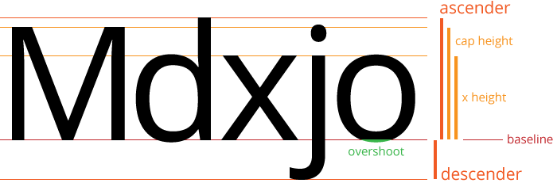
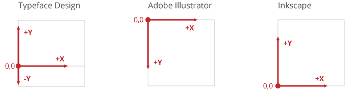

# Making your first font with Glyphr Studio

## Intro

Glyphr Studio provides a large set of custom-designed vector editing tools for typeface design. It could be the only tool you need to create a whole typeface from start to finish.

You may have some characters designed in a different program like Adobe Illustrator or [Inkscape](https://www.inkscape.org). Or, maybe you prefer to do the majority of your design work in those programs. Luckily, Glyphr Studio is quite powerful when it comes to importing SVG. So, any program that can export SVG can easily be used to create a font in Glyphr Studio.

This tutorial will go through an overall process. The beginning and end contain recommendations that are applicable to all tools. The middle will include details of setting up either Glyphr Studio, Inkscape, or Adobe Illustrator.

## Step 1: Figure out your key metrics

To avoid headaches down the road, we are going to do a little work up front to make sure our **graphic design space** (a.k.a. Adobe Illustrator or Inkscape) matches our **typeface design space** (a.k.a. Glyphr Studio).

Characters (or glyphs) in a typeface exist in what's called an "Em" Square. The Latin Capital Letter M is fairly square in its dimensions, and back in the physical typesetting days, it was used as a standard block or size for type. These days, the "`em`" continues to be used as the unit of measure for font files. For simplicity you can think of an `em` the same way as you think of pixels being the unit of measure for graphic design.

Glyphr Studio has a default setting of `2048 em` (which is very common for fonts, `1000 em` is the other common size) which means from the top of the tallest letter to the bottom of the descender measures a total of `2048 em` units. Most individual characters are _not_ `2048 em` tall, or `2048 em` wide - but this "Em Square" is the default overall design space.

In typeface design lingo, these main measurements are called _glyph metrics_ or _key metrics_. Here is a quick run-down, with Glyphr Studio defaults in parenthesis.

- **Ascender** (`1550 em`) distance from the baseline up to the tallest letter.
- **Descender** (`-440 em`) distance from the baseline down to the bottom of the lowest letter. The size of the descender is usually shown as a negative number.
- **Baseline** - split between the ascender and descender.
- **Cap Height** (`1480 em`) distance from the baseline to the top of the tallest capital letter. Many times, this is shorter than the overall Ascender.
- **X Height** (`1100 em`) distance from the baseline to the top of (not-rounded) lowercase letters.
- **Overshoot** (`30 em`) the distance that rounded letters extend above or below guidelines. This is usually done to visually compensate between rounded letters and squared-off letters.

Inkscape, as another example, uses these default key metrics for their `1000 em` font:

- **Ascender** `750 em`
- **Cap Height** `600 em`
- **X Height** `400 em`
- **Descender** `200 em` (in Inkscape, Descender is shown as a positive value)

There are no hard-and-fast rules about the proportions of these values, it's up to you to decide what looks good for the typeface you are designing. If you don't know where to begin, you can just use these defaults.

**First item to do**: decide on these overall key metrics. At the very least, choose an overall size (either `1000 em` or `2048 em`) and decide where the baseline falls within that height.

## Step 2: Set up your workspace

The first decision for setting up your workspace is how to handle all the characters. For example, the [Basic Latin Character Range](<https://en.wikipedia.org/wiki/Basic_Latin_(Unicode_block)>) in Unicode has 95 characters - letters, numbers, and symbols. You don't have to design all of them, but there are a few main ways to handle all these characters:

1. Create a single artboard with 95 layers
2. Create 95 artboards to show all characters at once
3. Use one wide artboard to show characters side by side

The pros for #1 and #2 is that there is an automated way to save single artboards or layers as individual `.svg` files. Glyphr Studio can import characters as individual `.svg` files, but it can also accept pasted SVG code as text. Option #3 works best in Adobe Illustrator because you can copy a subset of shapes and have the SVG code copied to your system clipboard, which can then be pasted into a Character in Glyphr Studio.

The next part of the tutorial depends on what program you are using to do your actual design work.

### Step 2 option 1 - Use Glyphr Studio

Glyphr Studio has a Pen and Arrow tool that work very similarly to other graphic design Path and Shape edit tools. If you are familiar with the way vector tools work, you should be able to jump into Glyphr Studio and use the tools with very little learning curve.

Setting up your design space is also easy - if you want to use the default key metrics for a `2048 em` font, the defaults are ready to go. Otherwise, you can navigate to the **Settings** page, **Font** tab, **Key Metrics** section to make any changes before you get started.

On the **Settings** page, **Project** tab is also where you can add or remove Character Ranges from your project. The default is the Basic Latin range, but you can change it to any range in Unicode that you want.

Once you start designing a character, you can change the **Panel** to **Guidelines**, which include guidelines for your font's key metrics, and also any custom guidelines you want.

### Step 2 option 2 - use Inkscape

[Inkscape](https://www.inkscape.org) is a powerful, open source, and free vector illustration tool. It's base format is just SVG, which is perfect for us, because Glyphr Studio speaks SVG fluently. Inkscape is also unique in that it has built-in support for creating SVG Fonts. There are some pros and cons to going this route (which we discuss below) but it is a key difference if you are trying to choose between Inkscape and other programs.

#### Using Inkscape's built in Font features

Inkscape has built-in UI and processes that help you design a font, and result in exporting an SVG Font file. SVG Font is a deprecated font file format... so you can't use an SVG Font on your computer or website. But, SVG Font is still used by other font programs, like Font Forge, Inkscape, and Glyphr Studio.

In Inkscape, you can go to **File** > **New From Template** > **Custom** > **Typography Canvas**, and a new SVG Font document will be set up for you. Mainly, there is an "SVG Font Editor" tab in the panel area that requires some input.

You can read up on Inkscape's documentation on [using the SVG Font Editor features](https://inkscape-manuals.readthedocs.io/en/latest/creating-custom-fonts.html).

The resulting SVG Font can be dragged-and-dropped or loaded on Glyphr Studio's New Project page. All the characters that you designed in Inkscape will be brought over and translated into a Glyphr Studio project. <!--Glyphr Studio can also export SVG Fonts, which can then in turn be opened back up by Inkscape.-->

#### Using Inkscape's general vector editing features

If you do not want to use Inkscape's SVG Font features, you can still just set up a generic artboard and use layers to create each character.

Guidance for setting up a document in Inkscape:

- Create a new document and go to File > Document Properties > Page (tab)
  - Under General, set the **Display Units** to **px**
  - Under Custom Size, _first_ set the **Units** to **px**
  - _Then_ set the **Height** to **`2048 px`** and the **Width** to **`2048 px`**
  - Under Scale, set **Scale x** to **1**, Scale y should automatically change to 1
  - If you expand the Viewbox section, `x` and `y` should be `0` and Width and Height should be `2048 px`
- From the top ruler, drag down a guideline and place it at `440 px` - this will be your baseline.
  - You can double-click the guideline to adjust it's `y` value and to lock individual guides.
  - Optionally place guidelines for X Height at `1540 px` and Cap Height at `1920 px` (see note below about coordinate systems).
  - It's probably a good idea to lock your guidelines in place.

Then create a new layer for each character you want to design. When you are done, you can go to **File** > **Export** > **Batch Export** (tab) > **Layers** (button). At the bottom of the Export panel, set the Format to "Plain SVG (\*.svg)". You can check the Preview to make sure your layers look as expected (make sure to toggle them all to be visible). At the bottom of the Export panel, press the Export button when everything looks good, and this will create a single `.svg` file for each layer / character you have.

Then, in Glyphr Studio, after you have created a new project, these single `.svg` files can be dragged+dropped onto the edit canvas for the corresponding character. This will import the SVG into Glyphr Studio.

### Step 2 option 3 - Use Adobe Illustrator

Having one artboard that is the correct height, but very wide, allows you to design a bunch of characters and have them sit side-by-side. I find that seeing all my characters side by side actually helps me design the characters themselves. Much of typeface design is about how a single character looks, but it is also very much about how all the characters look _together_.

Adobe Illustrator is able to select a subset of shapes on an artboard, copy, then paste the SVG code someplace else. So, if you set up an artboard and guidelines that are the appropriate height, but very wide, you can design many characters together on one wide artboard.

Alternatively, you can set up a single artboard and use layers to separate your characters. Or, set up a grid of artboards, one for each character. With this approach, you can automate exporting single `.svg` files per layer or artboard. Then, you can drag+drop those `.svg` files onto their corresponding character's edit canvas in Glyphr Studio to import them.

Guidance for setting up a document in Illustrator:

- Create a new document and set the **units dropdown** to **Pixels** and set **Width** and **Height** to **`2048 px`**. Or select the artboard tool to adjust the dimensions of an existing artboard.
- Make sure the upper-left corner of your artboard is `0,0` - with the artboard tool selected the `x` and `y` coordinates should be `0`.
  - If you move the artboard later, be sure to re-zero the coordinates of the artboard. The artboard coordinates affect the position of the exported shapes.
- Make sure the rulers are visible either through the view menu or right-clicking the canvas. From the top ruler, drag down a guideline and place it at `1550 px` - this will be your baseline.
  - If you select a guide, you can set its `y` value directly from the properties bar.
  - Optionally place guidelines for X Height at `508 px` and Cap Height at `168 px` (see note below about coordinate systems).
  - It's probably a good idea to lock your guidelines in place, either individually via the Layers Panel, or globally via Right Click > Lock Guides.

Once you're ready to export:

1. **One character per layer**
   - On the Layers panel, select a single layer that corresponds to a single character. At the bottom there is a small button for "Collect for Export" (a square with an arrow going diagonally up and to the right). Press the "Collect for Export" button for each layer.
   - Then, in the Asset Export panel, select all the characters. You can do this by selecting the first one in the list, pressing `Shift`, then select the last one in the list. Or, hold down `Ctrl` to toggle individual characters for export.
   - At the bottom of the Asset Export panel, set the Format to SVG.
   - When everything looks good, hit the "Export..." button at the very bottom of the panel. Your OS file dialog will then ask you where you want to save all the files.
2. **One character per artboard**
   - Make sure your artboards have a name that makes sense, like the character it represents.
   - Go to **File** > **Export** > **Export as...**
   - In the "File name" field, put the name of your font family, it will be used as a prefix for all the files you export. Select "Save as type" to SVG.
   - Check the "Use Artboards" checkbox, with the "All" radio button selected. Make sure the "Suffix" checkbox is checked.
   - Hit the "Export" button.
   - On the SVG Options dialog, most of these options do not matter. Hit the "OK" button to finally export the files.
3. **Use one wide artboard showing characters side by side**
   - Using the Selection (arrow) tool, select the shapes that correspond to a single character.
   - Copy them, either by Right Click > Copy menu, or `Ctrl`+`C` keyboard command.
     - In Adobe Illustrator, it's possible to select shapes and use `Ctrl`+`C` to copy SVG code to your OS Clipboard. You may need to enable this setting in **Edit** > **Preferences** > **Clipboard Handling** then check the "Include SVG Code" checkbox.
   - Switch your window to Glyphr Studio. Make sure your Key Metrics are set up appropriately as discussed in the first section. On the Characters page, navigate to the Character that you are working with.
   - Use your keyboard to paste, `Ctrl`+`V`.

## Step 3(ish): Some random things to consider

### Getting a feel for the overall process

I would recommend starting with just a few characters - maybe 5 or so - and trying to go through the next export / import steps to get a feel for the overall process. There may be some quirks in your design tool or in Glyphr Studio that are better discovered and worked out _before_ you've gone off and designed a hundred characters.

### Compound shapes and negative space

Right away you'll probably need to know how to create **compound shapes**. This is how you achieve a shape like an `O` - this character is just two circles. Compound shapes are how we tell the design program we want the center of the o to be transparent.

- **Adobe Illustrator** - multi-select two shapes and either **Right Click** > **Make Compound Path**, or use the Pathfinder panel.
- **Inkscape** - multi-select two shapes and use the menu **Path** > **Difference**, or press `Ctrl`+`-`

### Imported SVG may not have the appropriate `y` value

In the section below, "A note about coordinate systems", you can learn more about the different ways programs define what `y = 0` means. Unfortunately, there is no way around this when you import from SVG.

All of your characters should have a common baseline, though - which means they should all be off by the same amount. After you are done importing all your characters, you can go to the Global Actions page. Here, you can do bulk actions, including moving all shapes for all characters. This may help you move everything down a certain amount, so that your imported shapes look like they are actually sitting on the baseline.

### A note about coordinate systems

Measuring where things are is important to any design process, and unfortunately graphic design spaces are measured differently than typeface design spaces. Making Em Units equal to Pixels is a great first step to making things easier.

The origin of the coordinate system is a little more tricky. In the typeface design space the origin `0,0` is relative to the baseline, which is part of the way down the overall Em Square. So `x = 0` is the left-hand edge, and moving to the right increases the `x` value. `y = 0` is the baseline, so moving up from the baseline increases the `y` value, and moving down from the baseline creates negative `y` values.

In Adobe Illustrator, the `0,0` point is in the upper left, and in Inkscape, the `0,0` point is in the lower left. In the end, they both save as SVG (which has the `0,0` point in the upper left) so importing to Glyphr Studio works from both programs. Depending on what you use, you may have to do a bit of math to figure out where your various guides should be to match the glyph metrics in your font. The instructions in the previous section match the defaults Glyphr Studio uses, so that's a good place to start.

## Step 4: Prepare your designs for import

Here are a few things you may want to do before importing SVG into Glyphr Studio. In my typeface projects, I usually start with a _design_ file, called something like `My Font - working.ai`. When I'm pretty happy with everything, I make a copy of it and call it something like _flattened_ or _export_ `My Font - flattened.ai`. In the copied file I can make all kinds of destructive actions, like removing guidelines or random shapes, flattening shapes, outlining strokes... basically all the stuff outlined below.

### Flatten your characters

Many times it's easy to design characters using lots of shapes. For example, a Capital H is pretty easy to make with 3 rectangles. In a Font File, these same three rectangles are perfectly valid, but it's a best practice to try to minimize the number of shapes in your characters as much as possible. In the H example, those three rectangles can be combined to one path with 12 points.

Partially this is for font file efficiency, but there is also a very strange bug with certain programs that read font files. Sometimes overlaps are shown as transparent, but only at small font sizes ([read our faq on this topic](../faq/transparent-overlaps.md)). There is no way to fix this besides having a well-formatted font file to begin with.

### Outline any strokes

Shapes in fonts don't have strokes with weights, they are just simple filled shapes. You may have used stroke weights on paths in your design file, but you'll need to convert these to shapes before you import them.

- **Adobe Illustrator** - Select the path, then from the menu select **Object** > **Path** > **Outline Stroke**
- **Inkscape** - Select the path, then from the menu select **Path** > **Stroke to Path**

## Step 5: Import to Glyphr Studio

By this point you should either have individual `.svg` files for each character you have designed, or you can copy/paste SVG code that corresponds to a single character.

It's time to head on over to [glyphrstudio.com/app](https://www.glyphrstudio.com/app) and do the following:

- On the **New Project** page, give your project / font a name, then press **Start a new font from scratch**.
- By default you land on the **Overview** page. Go to the upper left Page menu and navigate to the **Settings** page, then select the **Font** tab.
  - Review the **Key Metrics** and make sure they match your design dimensions. If you started with the default dimensions described in this article, no changes should be necessary.
  - Change tabs to the **Project** tab, and review the **Enabled character ranges**. By default Basic Latin is selected, but if you have additional glyphs you can enable those glyph ranges here.

### Importing SVG

In Glyphr Studio v2, importing your SVG is as easy as drag+dropping a file or copy/pasting SVG code onto the Edit Canvas for that character.

- Using the upper left **Page** menu, navigate to the **Characters** page.
- Using the **Editing** menu, navigate to the character that you want to import SVG for.
- Drag and drop your SVG file right onto the edit canvas, or hit `Ctrl`+`V` to paste SVG code after you've clicked on the edit canvas.
  - In Adobe Illustrator, it's possible to select shapes and use `Ctrl`+`C` to copy SVG code to your OS Clipboard. You may need to enable this setting in **Edit** > **Preferences** > **Clipboard Handling** then check the "Include SVG Code" checkbox.

### Some Notes

- **Imported shapes are positioned far away from the origin?** On the **Settings** page **App** tab, toward the bottom there is an option called **Move shapes when importing an SVG file**. If your imported shapes are positioned oddly, this option will move the shapes back to `0,0` after they are imported. One step further is the option called **Add default Side Bearings when importing an SVG file**. This will position imported shapes a specified number of `em` units from `y = 0`, and also add an Advance Width so that same measurement is on the right-hand side as well.
- **Winding is important**, that is the direction, either clockwise or counterclockwise, that your path travels. In graphic design, path winding is not important. But in typeface design, paths with different winding 'cut out' each other, or appear transparent in the regions where they overlap. Compound shapes should import to Glyphr Studio as paths with different winding - but if some shapes seem like they should have transparent regions but don't, go check that path's winding. In Glyphr Studio the **winding** attribute is on the **Path** card for the selected shape.
- For each character, remember to add **Advance Width**, or update the **Side Bearings**. These are crucial properties for a character in a font (how much horizontal space it takes up) but your graphic design program has no concept of it. If you use the Live Preview tool in Glyphr Studio, or export and install your font and all the characters are just stacking on top of each other, then the Advance Width was probably left at zero.

# Thank you!

If you have any questions or feedback, you can check out [glyphrstudio.com/help](https://www.glyphrstudio.com/help) or just send me an email at [mail@glyphrstudio.com](mailto:mail@glyphrstudio.com).
